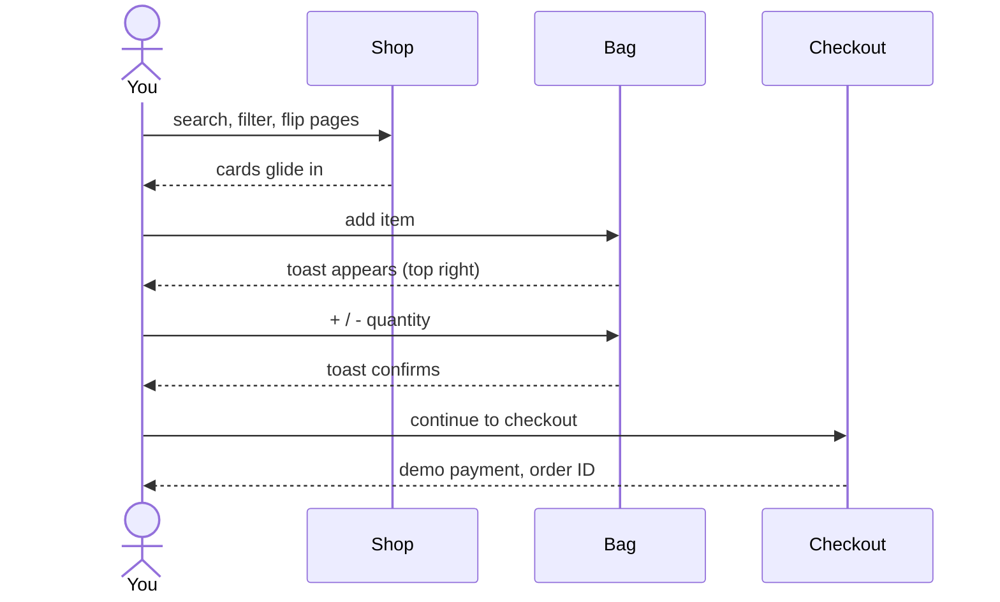

```
 ┌──────────────────────────────────────────────┐
 │                                              │
 │    f.  forma.                                │
 │                                              │
 │    Thoughtful things.  Better everyday.      │
 │                                              │
 └──────────────────────────────────────────────┘
```

A minimal React shop with a smooth, friendly feel.
Every click answers back: a toast, a slide, a gentle bounce.

`React 18` · `Vite` · `Router` · `Toastify` · `Josefin Sans` · `Light + Dark`

---

## 01 — Journey



---

## 02 — Highlights

- [x] **Animated pagination** with arrow buttons and a sliding page pill
- [x] **Toast feedback** on add, increase, decrease, remove and clear
- [x] **Demo checkout** with a validated card form and a success screen
- [x] **Light and dark mode** that remembers your choice
- [x] **Persistent bag**, still there after a refresh
- [x] **Live search**, category chips, price slider and sorting
- [x] **Josefin Sans only**, no italics
- [x] **Responsive** from phone to desktop

---

## 03 — Run it

```bash
npm install
npm run dev
```

Open the local link from the terminal.

<details>
<summary><b>Only copied the <code>src</code> folder?</b></summary>
<br />

```bash
npm install react react-dom react-router-dom lucide-react react-toastify
```

</details>

---

## 04 — Test the payment

1. Add any product to the bag
2. Open the bag and press **Continue to checkout**
3. Enter anything, e.g. card `4242 4242 4242 4242`
4. Pay and watch the confirmation

`Demo only. No money moves and no data leaves your browser.`

---

## 05 — Tweak

| Change | Open |
| :-- | :-- |
| Products per page | `pages/Home.jsx` → `PAGE_SIZE` |
| Shipping rule | `data/products.js` |
| Colours | top of `styles.css` |
| Toast position | `main.jsx` → `ToastContainer` |

<details>
<summary><b>Project map</b></summary>
<br />

```
src/
├── components/   Navbar · ProductCard · Pagination · CartItem · CheckoutModal
├── pages/        Home · CartPage
├── context/      CartContext · ThemeContext
├── hooks/        useProducts
├── data/         fallback products · price helpers
└── styles.css    styles + light/dark tokens
```

</details>


<div align="center">

# f. forma.

**Thoughtful things. Better everyday.**

A minimal React shop with animated pagination, instant toasts,
a demo checkout and a light / dark theme.


</div>

---

<sub>forma. · made with React · designed for everyday</sub>